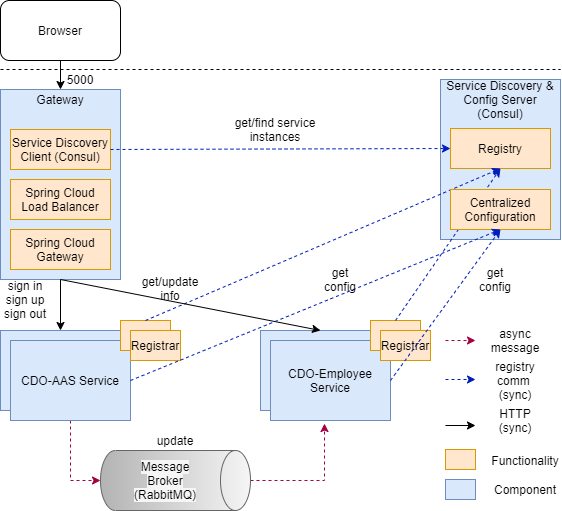

# Introduction 
"Capability Development System“ is a sub module of the internal CRM
+ Manage and define career paths
+ Manage and suggest training plans
# Architecture

# Requirements
* JDK 
* Node.js 
* npm 
* RabbitMQ 
* Consul 

# Build and Test
1. You need a RabbitMQ server running. Run the server according to the instructions for your OS, for example:
    ```bash
    $ rabbitmq-server
    ```
2. You also need Consul up and running (in development mode). Follow the instructions for your OS, for example:
    ```bash
    $ consul agent -node=cdo-consul -dev -client 0.0.0.0
    ```
	Then import global configuration setting
	```bash
    $ consul kv import @global_config.json
    ```
3. To start the Authentication&Authorization microservice, you can use the command line with the included Maven wrapper:
    ```bash
    cdo-aas$ ./mvnw spring-boot:run
    ```
2. To start the Employee microservice, you do the same from its corresponding folder:
    ```bash
    cdo-employee$ ./mvnw spring-boot:run
    ```
3. To start the Gateway microservice, you do the same from its corresponding folder:
    ```bash
    gateway ./mvnw spring-boot:run
    ```
2. The Angular application can be started with npm. First, you need to download the dependencies with:
    ```bash
    crm-app-client$ npm install
    ```
3. Then, you start the server with:
    ```bash
    crm-app-client$ npm start
    ```
# Notes
If ./mvnw spring-boot:run could not run, please install mvn wrapper:
    ```bash
    cdo-aas$ mvn -N io.takari:maven:wrapper
    ```